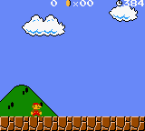

# Super Mario Bros. Deluxe - Reinforcement learning

<div align="center">
    <p>
        Train an agent to play Super Mario Land Deluxe (Game Boy Color) 
        using reinforcement learning.
    </p>
  
</div>

*Disclaimer: This project is for educational purposes only. 
Super Mario Bros. Deluxe is a trademark of Nintendo.*

## Set-up

Install dependencies with:

```bash
uv sync
```

## Usage

Given, you've placed your own game ROM in a `game/` directory;
there are three steps to get the project up and running:

1. Train the model (**optional**)
2. Let the trained agent play the game
3. Record the agent's best run

### Model training - **optional**:

To train the model (Proximal Policy Optimization algorithm) run:

```bash
uv run train.py
```

... which will train for 1 million steps. A callback saves the model every 
100k steps.

For convenience, the model is already available in the `models` directory.

<details>
<summary>ℹ Environment details</summary>

By default, the agent starts at the beginning of Level 1-1. After each
step, the emulator is progressed by 5 frames. Which means the agent can 
take an action every 5 frames. The agent has 7 possible actions:

- no action
- right
- right + A
- right + B
- right + A + B
- A
- left

Following, points lead to a positive reward:

- Movement to the right
- If the player pose is set to "walking"
- Jumping
- The game score
- If the agent is in a power up state (got a mushroom, fire flower, etc.)

Contrary, the agent is penalized if:

- The timer is already pretty low (less than 50 seconds remaining)
- Movement to the left
- The player is dead

The reward fo each step is clipped to the range -25 to 25 in order to
prevent extreme values.

> [This](https://danieltakeshi.github.io/2016/11/25/frame-skipping-and-preprocessing-for-deep-q-networks-on-atari-2600-games/)
> blog post provides an excellent overview on pre-processing steps.

</details>

### 🕹 Play the game:

To run the model, execute:

```bash
uv run play.py
```

... which will play 100 games.
The best run (i.e., if the agent actually cleared the first level)
is stored. 

### 📹 Record the agent's best run:

To recreate the agent's best run and record it, execute:

```bash
uv run record.py
```

### Bonus:

If you want to see how an untrained agent performs, if random actions are 
taken, run:

```bash
uv run random_actions.py
```

The script will save a recording like the one below:

<div align="center">
    
</div>
